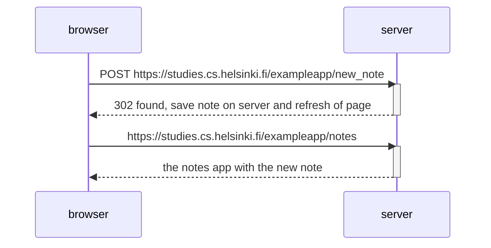

```mermaid
sequenceDiagram
    participant browser
    participant server

    browser->>server: POST https://studies.cs.helsinki.fi/exampleapp/new_note
    activate server
    server-->>browser: 302 found, save note on server and refresh of page
    deactivate server

    browser->>server: https://studies.cs.helsinki.fi/exampleapp/notes
    activate server
    server-->>browser: the notes app with the new note
    deactivate server
```

