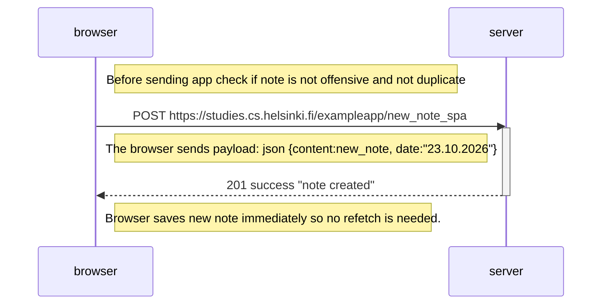

```mermaid
sequenceDiagram
    participant browser
    participant server
     Note right of browser: Before sending app check if note is not offensive and not duplicate

    browser->>server: POST https://studies.cs.helsinki.fi/exampleapp/new_note_spa
    activate server
         Note right of browser: The browser sends payload: json {content:new_note, date:"23.10.2026"}
    server-->>browser: 201 success "note created"
    deactivate server
    Note right of browser: Browser saves new note immediately so no refetch is needed.


   
```
